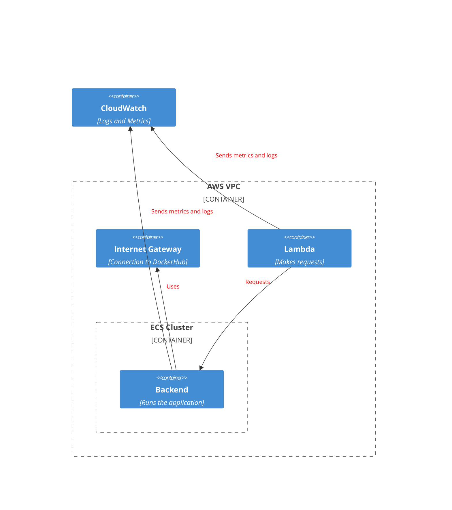

# Putting it all together

!!! abstract "Create all the infrastructure using CloudFormation, everything fits in a single stack"

## Architecture



## VPC

Create a VPC with a **Subnet with a public IP** and an **Internet Gateway**.

## ECS

### Cluster

Create an ECS cluster **scheduling on Fargate**

[What is Fargate?](https://docs.aws.amazon.com/AmazonECS/latest/userguide/what-is-fargate.html)

??? info "Scheduling on Fargate"

    ```yaml
      CapacityProviders:
        - FARGATE
        - FARGATE_SPOT
      DefaultCapacityProviderStrategy:
        - CapacityProvider: FARGATE
          Weight: 1
        - CapacityProvider: FARGATE_SPOT
          Weight: 1
    ```

### Service

Create an ECS service running **nginx**. Send **metrics and logs to CloudWatch**. Expose the service through a
**load balancer**. Register the service in **CloudMap**.

## Lambda

Create a Lambda that is **triggered on a schedule**. The Lambda should make requests to the ECS service using the
**CloudMap service discovery**. Send **metrics and logs to CloudWatch**.

??? info "Lambda HTTP example in Python"

    ```python
    --8<-- "docs/content/aws/final/lambda.py"
    ```